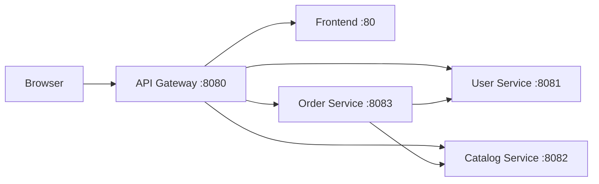

# NexusCart API Gateway

The API Gateway is the single public HTTP entry point for NexusCart. It serves
the frontend, routes API calls to the owning service, propagates request IDs,
and exposes a consolidated health surface.

The runtime uses the built-in Node.js HTTP modules and has no third-party
production dependency.

## ✨ Highlights

- One browser origin for the frontend and all `/api/v1/*` requests.
- Segment-safe routing for User, Catalog, and Order APIs.
- Generated or caller-provided `X-Request-ID` propagation.
- Forwarded client headers for upstream request context.
- Configurable upstream timeouts and a 1 MiB default body limit.
- Common JSON errors for routing and upstream failures.
- HTML health dashboard plus stable component health endpoints.
- Structured request logs and graceful shutdown.
- Non-root Node.js container with a built-in health check.

## 🧭 Application Architecture



The gateway preserves each request path and query string when forwarding it.
Unknown non-API paths go to the frontend so client-side routes can use the
NGINX SPA fallback.

## 🛣️ Routing Table

| Public path | Destination |
|---|---|
| `/` and non-API paths | Frontend |
| `/api/v1/users` and descendants | User Service |
| `/api/v1/products` and descendants | Catalog Service |
| `/api/v1/orders` and descendants | Order Service |
| `/health` | Integrated HTML health dashboard |
| `/liveness` | API Gateway process liveness JSON |
| `/gateway-health` | Legacy API Gateway health alias |
| `/health/api-gateway` | API Gateway health JSON |
| `/health/frontend` | Frontend `/health` |
| `/health/user-service` | User Service `/health` |
| `/health/catalog-service` | Catalog Service `/health` |
| `/health/order-service` | Order Service `/health` |
| `/api/v1/system/versions` or `/health/versions` | Consolidated JSON version report for the gateway and downstream services |

Routing matches complete path segments. For example,
`/api/v1/users/usr-001` is valid, while `/api/v1/users-extra` is not treated
as a User Service route.

## 🧪 Request Examples

Check the gateway version:

```bash
curl -i http://localhost:8080/health/api-gateway
```

Trace a request across the gateway and User Service:

```bash
curl -i \
  -H "X-Request-ID: docs-gateway-001" \
  http://localhost:8080/api/v1/users/usr-001
```

Inspect the deployed version and image tag snapshot for all services:

```bash
curl -i http://localhost:8080/api/v1/system/versions
```

Create an order through the public entry point:

```bash
curl -i \
  -X POST http://localhost:8080/api/v1/orders \
  -H "Content-Type: application/json" \
  -d '{"userId":"usr-001","items":[{"productId":"prd-001","quantity":2}]}'
```

## ⚠️ Gateway Errors

| Status | Code | Condition |
|---:|---|---|
| `400` | `INVALID_REQUEST_URL` | Request target is not a safe relative URL |
| `404` | `ROUTE_NOT_FOUND` | No service owns the requested `/api/*` path |
| `405` | `METHOD_NOT_ALLOWED` | Health dashboard receives a method other than GET or HEAD |
| `413` | `PAYLOAD_TOO_LARGE` | Request body exceeds `MAX_BODY_BYTES` |
| `502` | `UPSTREAM_UNAVAILABLE` | Target service cannot be reached |
| `504` | `UPSTREAM_TIMEOUT` | Target service exceeds `REQUEST_TIMEOUT_MS` |

```json
{
  "error": {
    "code": "UPSTREAM_UNAVAILABLE",
    "message": "user-service is unavailable",
    "requestId": "docs-gateway-001"
  }
}
```

Component health failures use `503` with `status: "DOWN"` instead of the
application error shape.

The version report normalizes each component payload to include both `version`
and `imageTag`. When a service does not expose a separate `imageTag`, the API
falls back to the reported `version`.

## 🚀 Quick Start

### Prerequisites

- Node.js 24 and npm.
- Frontend, User, Catalog, and Order services running locally.

PowerShell example:

```powershell
$env:PORT = "8080"
$env:APP_VERSION = "local"
$env:FRONTEND_URL = "http://localhost:5173"
$env:USER_SERVICE_URL = "http://localhost:8081"
$env:CATALOG_SERVICE_URL = "http://localhost:8082"
$env:ORDER_SERVICE_URL = "http://localhost:8083"
npm ci
npm start
```

Open the storefront at <http://localhost:8080> or the health dashboard at
<http://localhost:8080/health>.

For the simplest complete setup, use Docker Compose from the sibling
`config-management` repository.

## ⚙️ Runtime Configuration

| Variable | Default | Purpose |
|---|---|---|
| `PORT` | `8080` | Public HTTP listen port |
| `APP_VERSION` | `1.0.0` | Gateway health version |
| `FRONTEND_URL` | `http://frontend:80` | Frontend base URL |
| `USER_SERVICE_URL` | `http://user-service:8081` | User Service base URL |
| `CATALOG_SERVICE_URL` | `http://catalog-service:8082` | Catalog Service base URL |
| `ORDER_SERVICE_URL` | `http://order-service:8083` | Order Service base URL |
| `REQUEST_TIMEOUT_MS` | `10000` | Application upstream timeout |
| `HEALTH_TIMEOUT_MS` | `4000` | Component health timeout |
| `MAX_BODY_BYTES` | `1048576` | Maximum proxied request body |

Invalid ports, non-positive numeric limits, and non-HTTP(S) upstream URLs fail
fast during startup.

## ✅ Quality Gates

```bash
npm ci
npm test
npm run check
npm run build
```

Tests create temporary HTTP upstreams and verify path selection, query and body
forwarding, request IDs, frontend fallback, health proxying, unavailable
upstreams, and payload limits. `npm run check` validates JavaScript syntax,
and `npm run build` verifies the server entrypoints are still valid.

## 🐳 Container Image

```bash
docker build -t nexuscart-api-gateway:local .
docker run --rm -p 8080:8080 \
  -e APP_VERSION=local \
  nexuscart-api-gateway:local
```

The standalone container always exposes its own `/gateway-health`. Application
routes require reachable upstream URLs, so Docker Compose is recommended for
full-stack use.

## 🔁 CI/CD

`azure-pipelines.yml` is a small entry point that composes reusable checkout,
Node setup, install, native test, report, and Qodana step templates from
`config-management`. Shared stage and job templates own the orchestration.

- Every branch publishes JUnit and coverage reports, runs Qodana, builds the
  image, and scans it with Trivy.
- `main` pushes the `$(Build.BuildId)` and `latest` tags to Azure Container
  Registry.

## 📁 Repository Structure

```text
api-gateway/
├── public/health.html      # Integrated health dashboard
├── src/
│   ├── gateway.js          # Routing, proxying, errors, and health
│   └── server.js           # Process lifecycle and listen port
├── test/gateway.test.js    # Gateway integration tests
├── azure-pipelines.yml
├── Dockerfile
├── package.json
└── package-lock.json
```
