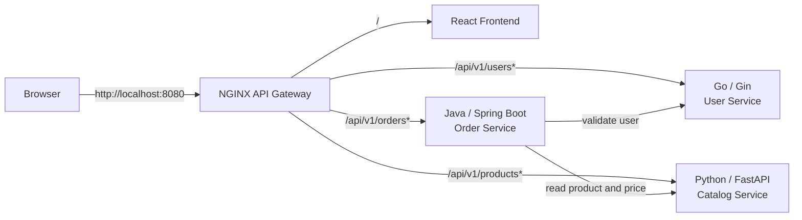

# Polyglot Mini Shop

> Trạng thái: **MVP đã được triển khai và kiểm thử end-to-end**.

Polyglot Mini Shop là một ứng dụng demo microservices nhỏ, gồm đúng **4 application service**: 1 frontend và 3 backend. Một NGINX API Gateway được đặt phía trước như thành phần hạ tầng thứ năm để trình duyệt chỉ cần giao tiếp với một địa chỉ duy nhất.

## 1. Mục tiêu

- Minh họa một luồng nghiệp vụ end-to-end dễ hiểu: chọn khách hàng, xem sản phẩm, tạo và xem đơn hàng.
- Ba backend dùng ba ngôn ngữ/framework khác nhau.
- Chạy toàn bộ hệ thống bằng một lệnh Docker Compose.
- API nhỏ, có validation, health check, error format thống nhất và test cơ bản.
- Giữ MVP đủ gọn: dữ liệu seed lưu in-memory, chưa dùng database, auth hay message broker.

## Chạy nhanh

Yêu cầu duy nhất để chạy toàn stack là Docker Engine/Desktop có Docker Compose v2.

```bash
docker compose up --build
```

Trên máy hiện tại, Docker Engine nằm trong WSL nên có thể chạy trực tiếp từ PowerShell bằng:

```powershell
wsl bash -lc "cd /mnt/d/MT/AzureDevOps/platform && docker compose up --build"
```

Mở `http://localhost:8080`. Kiểm tra end-to-end bằng PowerShell:

```powershell
powershell -NoProfile -ExecutionPolicy Bypass -File scripts/smoke.ps1
```

Dừng và xóa các container/network của demo:

```bash
docker compose down
```

Chỉ API Gateway publish cổng ra host. Bốn application container còn lại chỉ giao tiếp trong Compose network.

## 2. Phạm vi service

| Thành phần | Công nghệ | Trách nhiệm | Cổng nội bộ |
|---|---|---|---:|
| `frontend` | React + TypeScript + Vite | Giao diện Mini Shop | `80` |
| `user-service` | Go + Gin | Danh sách và thông tin khách hàng | `8081` |
| `catalog-service` | Python + FastAPI | Danh mục, giá và tồn kho sản phẩm | `8000` |
| `order-service` | Java + Spring Boot + Maven | Tạo, lưu và truy vấn đơn hàng | `8083` |
| `api-gateway` | NGINX | Serve một public entry point và reverse proxy theo path | `80` |

`api-gateway` không được tính vào bốn application service; khi chạy Docker Compose sẽ có tổng cộng năm container. Chỉ gateway publish cổng `8080` ra máy host.

Các runtime, direct dependency và base image đều được khóa phiên bản; không dùng tag `latest`.

## 3. Kiến trúc



Nguyên tắc giao tiếp:

- Browser chỉ gọi `http://localhost:8080`; frontend không biết cổng riêng của backend.
- Gateway giữ nguyên path và chuyển request đến đúng service.
- `order-service` gọi trực tiếp `user-service` và `catalog-service` bằng DNS nội bộ của Docker Compose, không đi vòng qua public gateway.
- Các service trả JSON qua HTTP REST. MVP chưa cần giao tiếp bất đồng bộ.
- Gateway truyền `X-Request-ID` để có thể nối log giữa các service.

## 4. Luồng nghiệp vụ chính

1. Người dùng mở `/`; gateway trả frontend.
2. Frontend gọi `/api/v1/users` và `/api/v1/products` để tải dữ liệu seed.
3. Người dùng chọn khách hàng, sản phẩm, số lượng rồi gửi `POST /api/v1/orders`.
4. `order-service` xác nhận khách hàng tồn tại với `user-service`.
5. `order-service` lấy tên, giá và tồn kho hiện tại từ `catalog-service`, kiểm tra số lượng và tự tính tổng tiền.
6. Đơn hàng cùng snapshot sản phẩm được lưu in-memory tại `order-service`.
7. Frontend hiển thị kết quả và tải lại danh sách đơn hàng gần đây.

Việc lưu snapshot tên/giá sản phẩm trong đơn hàng giúp đơn cũ không đổi nếu catalog thay đổi. MVP chỉ kiểm tra tồn kho, chưa trừ hoặc giữ chỗ tồn kho.

## 5. API contract

Quy ước chung:

- Public API dùng prefix `/api/v1`.
- Request và response dùng JSON, field theo `camelCase`.
- Tiền VND dùng số nguyên (`long`/`int64`), không dùng floating point.
- Thời gian dùng ISO 8601 UTC, ví dụ `2026-08-11T08:30:00Z`.
- Mỗi backend có `GET /health`, chủ yếu dành cho Docker health check.

### 5.1 User Service — Go/Gin

| Method | Path | Kết quả |
|---|---|---|
| `GET` | `/api/v1/users` | Trả danh sách khách hàng |
| `GET` | `/api/v1/users/{id}` | Trả một khách hàng hoặc `404` |
| `GET` | `/health` | `200` khi service sẵn sàng |

Ví dụ response:

```json
{
  "items": [
    {
      "id": "usr-001",
      "name": "Nguyen Van An",
      "email": "an@example.com"
    }
  ]
}
```

### 5.2 Catalog Service — Python/FastAPI

| Method | Path | Kết quả |
|---|---|---|
| `GET` | `/api/v1/products` | Trả danh sách sản phẩm |
| `GET` | `/api/v1/products/{id}` | Trả một sản phẩm hoặc `404` |
| `GET` | `/health` | `200` khi service sẵn sàng |

Ví dụ response:

```json
{
  "items": [
    {
      "id": "prd-001",
      "name": "Mechanical Keyboard",
      "price": 1290000,
      "currency": "VND",
      "stock": 10
    }
  ]
}
```

### 5.3 Order Service — Java/Spring Boot

| Method | Path | Kết quả |
|---|---|---|
| `GET` | `/api/v1/orders` | Trả danh sách đơn hàng, mới nhất trước |
| `GET` | `/api/v1/orders/{id}` | Trả một đơn hàng hoặc `404` |
| `POST` | `/api/v1/orders` | Kiểm tra dữ liệu và tạo đơn hàng |
| `GET` | `/health` | `200` khi service sẵn sàng |

Request tạo đơn:

```json
{
  "userId": "usr-001",
  "items": [
    {
      "productId": "prd-001",
      "quantity": 2
    }
  ]
}
```

Response `201 Created`:

```json
{
  "id": "ord-001",
  "userId": "usr-001",
  "items": [
    {
      "productId": "prd-001",
      "productName": "Mechanical Keyboard",
      "unitPrice": 1290000,
      "quantity": 2,
      "lineTotal": 2580000
    }
  ],
  "totalAmount": 2580000,
  "currency": "VND",
  "status": "CREATED",
  "createdAt": "2026-08-11T08:30:00Z"
}
```

Validation tối thiểu:

- `userId` bắt buộc.
- Đơn hàng có ít nhất một item.
- `quantity` là số nguyên từ `1` đến `99` và không vượt tồn kho hiện tại.
- Không cho phép lặp `productId` trong cùng request.
- Client không gửi giá hoặc tổng tiền; `order-service` luôn tính từ dữ liệu catalog.

### 5.4 Error format chung

```json
{
  "error": {
    "code": "PRODUCT_NOT_FOUND",
    "message": "Product prd-999 does not exist",
    "requestId": "2f159fc0f3b84ced"
  }
}
```

Các status chính:

- `400` hoặc `422`: body/field không hợp lệ.
- `404`: resource trên URL không tồn tại.
- `409`: không đủ tồn kho.
- `503`: một upstream service cần thiết đang không sẵn sàng.
- `500`: lỗi ngoài dự kiến; không trả stack trace cho client.

## 6. Giao diện MVP

Một trang responsive duy nhất gồm:

- Header hiển thị tên ứng dụng và trạng thái kết nối.
- Select khách hàng lấy từ User Service.
- Grid sản phẩm hiển thị tên, giá VND, tồn kho và ô số lượng.
- Giỏ hàng tóm tắt, tổng tạm tính và nút **Create order**.
- Bảng **Recent orders** hiển thị mã đơn, khách hàng, tổng tiền, trạng thái và thời gian.
- Loading skeleton, empty state và error banner có nút retry.

Frontend dùng một API client tập trung với base URL tương đối `/api/v1`; không hard-code hostname backend.

## 7. Cấu trúc multi-repo

```text
AzureDevOps/
├── frontend/          # Git repo: React/TypeScript
├── user-service/      # Git repo: Go/Gin
├── catalog-service/   # Git repo: Python/FastAPI
├── order-service/     # Git repo: Java/Spring Boot
└── platform/          # Git repo: tích hợp và vận hành local
    ├── gateway/
    │   └── nginx.conf
    ├── scripts/
    │   └── smoke.ps1
    ├── docs/
    │   └── api-contract.md
    ├── compose.yaml
    ├── .env.example
    └── README.md
```

Năm thư mục trên là năm Git repository độc lập. `platform/compose.yaml` dùng build context `../frontend`, `../user-service`, `../catalog-service` và `../order-service`, vì vậy khi clone cần đặt năm repo cạnh nhau như sơ đồ.

## 8. Docker Compose và Gateway

Route dự kiến của NGINX:

| Public path | Upstream |
|---|---|
| `/` | `frontend:80` |
| `/api/v1/users...` | `user-service:8081` |
| `/api/v1/products...` | `catalog-service:8000` |
| `/api/v1/orders...` | `order-service:8083` |
| `/gateway-health` | NGINX trả trực tiếp `200` |

Quy tắc vận hành:

- Chỉ map `localhost:8080 -> api-gateway:80`; backend ở private Compose network.
- Thêm health check cho cả năm container.
- Dùng `depends_on` với điều kiện health phù hợp để giảm lỗi startup race.
- `order-service` nhận `USER_SERVICE_URL` và `CATALOG_SERVICE_URL` từ environment.
- Đặt connect/read timeout ngắn cho lời gọi nội bộ; lỗi upstream được map thành `503` rõ ràng.
- Frontend production build bằng multi-stage Dockerfile và được serve dưới dạng static assets.
- NGINX xử lý single-origin routing nên MVP không cần bật CORS rộng trên từng backend.

Khởi động toàn bộ stack bằng:

```bash
docker compose up --build
```

Sau đó mở `http://localhost:8080`. Dừng hệ thống bằng:

```bash
docker compose down
```

## 9. Dữ liệu seed

- `user-service`: 2–3 khách hàng cố định.
- `catalog-service`: 4–6 sản phẩm, giá VND và tồn kho khác nhau.
- `order-service`: khởi động với danh sách rỗng.
- ID có prefix dễ đọc: `usr-`, `prd-`, `ord-`.

Dữ liệu in-memory sẽ mất khi container restart. Đây là hành vi chủ đích của MVP, không phải cơ chế lưu trữ production.

## 10. Trạng thái triển khai

### Giai đoạn 1 — Chốt contract và nền repository

- [x] Tạo cây thư mục, `.gitignore`, `.env.example` và `compose.yaml` khung.
- [x] Chốt request/response/error schema trong `docs/api-contract.md`.
- [x] Chọn và pin phiên bản runtime/dependency được hỗ trợ.
- [x] Chuẩn hóa logging ra stdout và truyền `X-Request-ID`.

### Giai đoạn 2 — Ba backend độc lập

- [x] Xây `user-service` bằng Go/Gin với seed data, API và unit test.
- [x] Xây `catalog-service` bằng Python/FastAPI với model validation, API và test.
- [x] Xây `order-service` bằng Java/Spring Boot với repository in-memory và test.
- [x] Thêm `/health`, Dockerfile multi-stage và non-root user khi base image hỗ trợ.

### Giai đoạn 3 — Tích hợp tạo đơn

- [x] Viết HTTP client từ Order Service sang User và Catalog Service.
- [x] Thêm timeout và mapping lỗi `404`/`409`/`503`.
- [x] Tính line total/total amount ở server và lưu product snapshot.
- [x] Viết integration test cho happy path và các upstream failure chính.

### Giai đoạn 4 — Frontend

- [x] Scaffold React/TypeScript bằng Vite.
- [x] Xây API client, type model và các trạng thái loading/error/empty.
- [x] Xây màn hình chọn user, catalog/cart, submit order và recent orders.
- [x] Thêm component test tối thiểu và kiểm tra TypeScript trong build pipeline.

### Giai đoạn 5 — Gateway và chạy toàn stack

- [x] Viết NGINX routing, header forwarding và request ID.
- [x] Hoàn thiện Compose network, environment, health check và dependency order.
- [x] Đảm bảo chỉ gateway publish cổng ra host.
- [x] Chạy smoke test end-to-end qua `localhost:8080`.

### Giai đoạn 6 — QA và tài liệu bàn giao

- [x] Chạy unit/integration test của từng stack.
- [x] Chạy frontend typecheck, test và production build.
- [x] Kiểm tra Docker build sạch và khởi động lại toàn stack.
- [x] Bổ sung lệnh phát triển, troubleshooting và ví dụ API thực tế vào README.

## 11. Chiến lược test

| Mức | Phạm vi |
|---|---|
| Unit | Validation, tính tiền, mapping model và repository của từng service |
| API | Status code, schema và error envelope của từng endpoint |
| Integration | Order Service gọi mock/real User và Catalog Service |
| Frontend | Render dữ liệu, form validation, submit success/error |
| Smoke E2E | Qua gateway: health, list users/products, create order, get orders |

Lệnh test theo từng thư mục:

- Go: `go test ./...`
- Python: `pytest`
- Java: `./mvnw test` hoặc `mvnw.cmd test` trên Windows
- Frontend: `npm run typecheck`, `npm run test:run`, `npm run build`
- Toàn stack: `powershell -File scripts/smoke.ps1`

## 12. Definition of Done cho MVP

- `docker compose up --build` khởi động toàn bộ stack thành công từ máy sạch có Docker.
- Truy cập duy nhất `http://localhost:8080` và không cần cấu hình CORS thủ công trên browser.
- UI tải được user/product, tạo được order và hiển thị recent orders.
- Giá và tổng tiền do backend tính; request sai trả lỗi có cấu trúc.
- Các container có health check và log chứa request ID.
- Test chính của bốn application service pass.
- Không chứa secret, hostname máy cá nhân hoặc dependency dùng tag `latest`.

## 13. Ngoài phạm vi MVP

- Đăng nhập, phân quyền và quản lý secret.
- Database, migration, cache, message broker và distributed transaction.
- Trừ tồn kho thực sự hoặc xử lý concurrent reservation.
- Kubernetes, service discovery ngoài Docker DNS, autoscaling.
- Metrics, distributed tracing, rate limiting và circuit breaker hoàn chỉnh.

Hướng mở rộng hợp lý sau MVP là thêm database riêng cho từng backend, JWT tại gateway, OpenTelemetry, circuit breaker/retry có giới hạn, rồi mới cân nhắc Kafka/RabbitMQ cho luồng `OrderCreated`.

## 14. Rủi ro và trade-off đã biết

- Polyglot giúp minh họa nhiều stack nhưng làm build/test và dependency management nặng hơn một mono-stack.
- Java service có thời gian build/start và image lớn hơn Go/Python; multi-stage build và layer cache sẽ giảm phần nào chi phí này.
- Order Service phụ thuộc đồng bộ vào hai service khác khi tạo đơn; timeout rõ ràng và `503` giúp failure dễ quan sát, nhưng chưa tạo được đơn khi upstream lỗi.
- In-memory storage giúp demo nhanh nhưng không bền và chỉ phù hợp chạy một replica.
- NGINX đáp ứng tốt routing cơ bản; nếu cần auth policy, analytics, developer portal hoặc quota phức tạp thì nên chuyển sang một API Gateway chuyên dụng ở giai đoạn sau.

## 15. Tài liệu công nghệ

- [React với TypeScript](https://react.dev/learn/typescript)
- [Vite Getting Started](https://vite.dev/guide/)
- [Gin documentation](https://gin-gonic.com/en/docs/introduction/)
- [FastAPI documentation](https://fastapi.tiangolo.com/)
- [Spring Boot](https://spring.io/projects/spring-boot/)
- [NGINX proxy module](https://nginx.org/en/docs/http/ngx_http_proxy_module.html)
- [Docker Compose startup order](https://docs.docker.com/compose/how-tos/startup-order/)
